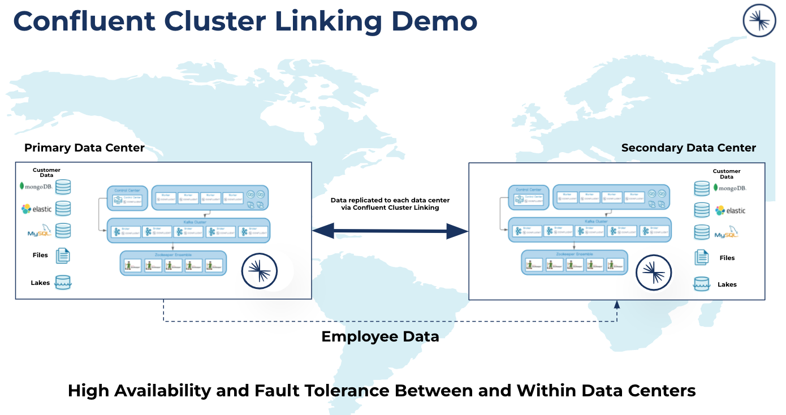

Cluster Linking is used to asyncronously share Kafka topics between two data centers. This can be for simple data sharing between two (or more) active data centers (e.g. data mesh) or disaster recovery scenarios.

In this demo, we will set up a Cluster Link between Primary and Secondary data centers. Employee data will be produced using a Kafka command line tool that will read mock data generated by Mockaroo.

We will also demonstrate ksqlDB to create streams and tables in order to use push and pull queries of the Employee data.

More information on Cluster Linking and another demo can be found [here](https://docs.confluent.io/platform/6.0.0/multi-dc-deployments/cluster-linking/docker-quickstart.html).

<br>

### Table of Contents
* [Setup](#setup)
* [Running](#running)
* [Produce Employee Data](#produce-employee-data)
* [Link Primary to Secondary Clusters](#link-primary-to-secondary-clusters)
* [Using ksqlDB](#using-ksqlDB)

<br>

# Setup
The following dependencies are needed:

* docker and docker-compose
* java runtime envrionment
* Confluent Platform -- curl -O http://packages.confluent.io/archive/7.0/confluent-7.0.1.tar.gz

Confluent Platform is installed in order to use the command line tools.

There are two docker-compose files available in the PRIMARY and SECONDARY folders. They can be run on the same node since the ports have been modified to avoid collisions. Running on two separate nodes is also possible but will require changes to the advertised listeners and other references to `localhost` in the docker-compose files and command line tools.

You may also need to update the permissions on the mapped volumes for Kafka and Zookeeper.

```
cd PRIMARY
chown -R 1000:1000 broker zookeeper

cd SECONDARY
chown -R 1000:1000 broker zookeeper
```

### Create a docker network
>docker network create demo-network

### Port Forwarding
If you are running on a cloud instance, you can use port forwarding to access the Confluent Control Center using the following ports:
>ssh -L 9021:localhost:9021 -L 8088:localhost:8088 -L 9091:localhost:9091 -L 9022:localhost:9022 -L 8089:localhost:8089 -L 9092:localhost:9092`

* 9021 and 9022 - Confluent Control Center
* 8088 and 8089 - ksqlDB
* 9091 and 9092 - brokers

<br>

# Running
Change directory to the PRIMARY folder and run: `docker-compose up -d`

Verify all components are up and running: `docker-compose ps`


Change directory to the SECONDARY folder and run: `docker-compose up -d`

Verify all components are up and running: `docker-compose ps`


Display the Primary Confluent Control Center `localhost:9021` or `<your ip>:9021`<br>
Display the Secondary Confluent Control Center `localhost:9022` or `<your ip>:9022`

<br>

# Produce Employee Data
>kafka-producer-perf-test --topic employees-pri --payload-file MOCK_DATA.json --num-records 100000 --throughput 5 --producer-props bootstrap.servers=localhost:9091

View the data in the Primary Confluent Control Center:


View using kafka-console-consumer:
>kafka-console-consumer --bootstrap-server localhost:9091 --topic employees-pri

<br>

# Link Primary to Secondary Clusters
Create a link between data centers:

```
docker exec broker-secondary kafka-cluster-links \
--bootstrap-server broker-secondary:19092 \
--create \
--link primary-cluster-link \
--config bootstrap.servers=broker-primary:19091
```

Create a mirror topic the employee data:

```
docker exec broker-secondary kafka-mirrors --create \
--bootstrap-server broker-secondary:19092 \
--mirror-topic employees-pri \
--link primary-cluster-link
```

View the data in the Secondary Confluent Control Center:


View using kafka-console-consumer:
>kafka-console-consumer --bootstrap-server localhost:9092 --topic employees-pri

<br>

# Using ksqlDB
Create a stream from the `employee-pri` topic:

```
CREATE STREAM EMPLOYEE_STREAM (
  `id` BIGINT,
  `first_name` VARCHAR,
  `last_name` VARCHAR,
  `email` VARCHAR,
  `gender` VARCHAR
  ) WITH (
    KAFKA_TOPIC='employees-pri',
    PARTITIONS=1,
    VALUE_FORMAT='JSON'
  );
```
**Ensure `auto.offset.reset` is set to `Earliest`** and then select `Run query`


Create a table from the `EMPLOYEE_STREAM` stream:

```
CREATE TABLE EMPLOYEE_TABLE AS
  SELECT `id`, 
      LATEST_BY_OFFSET(`first_name`) AS `first_name`,
        LATEST_BY_OFFSET(`last_name`) AS `last_name`,
        LATEST_BY_OFFSET(`email`) AS `email`,
        LATEST_BY_OFFSET(`gender`) AS `gender`
    FROM  EMPLOYEE_STREAM
    GROUP BY `id`; 

```
**Ensure `auto.offset.reset` is set to `Earliest` and `ksql.query.pull.table.scan.enabled` is set to `true`** and then select `Run query`


### Pull Query Examples

```
SELECT * FROM EMPLOYEE_TABLE;

SELECT * FROM EMPLOYEE_TABLE WHERE `gender`='Female';
```

